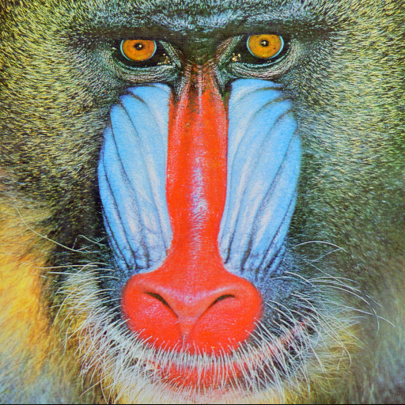

# Song2

Fast (linear time) implementation of the Gaussian Blur algorithm in Go.

Original taken from http://blog.ivank.net/fastest-gaussian-blur.html


## Install & Usage

### Package

Download and compile from this repository.

```sh
go get -u github.com/matsuyoshi30/song2
```

And import as a package, call the API `song2.GaussianBlur(src, blurRadius)`.

```go
package main

import (
    "fmt"
    "image"
    "image/png"
    "os"

    "github.com/matsuyoshi30/song2"
)

func main() {
    img, err := os.Open("./input.png")
    if err != nil {
        fmt.Println(err)
        return
    }

    img, _, err := image.Decode(file)
    if err != nil {
        fmt.Println(err)
        return
    }

    blured := song2.GaussianBlur(img, 3.0)

    out, err := os.Create("./output.png")
    if err != nil {
        fmt.Println(err)
        return
	}

    if err := png.Encode(out, blured); err != nil {
        fmt.Println(err)
        return
    }
}
```

### CLI tool

Clone this repository, and `go install`.

```sh
git clone https://github.com/matsuyoshi30/song2
cd song2/cmd/song2 && go install
```

You can use `song2` as a cli tool.

```sh
Usage:
  song2 [FLAGS] [FILE]

FLAGS:
  -o  Write output image to specifig filepath [default: blured.png]
  -r  Radius [default: 3.0]

Author:
  matsuyoshi30 <sfbgwm30@gmail.com>
```


## Example

|  Original                      |  Blured                      |
| ------------------------------ | ---------------------------- |
|  |  |

This image is from http://sipi.usc.edu/database/database.php?volume=misc&image=10#top


## Benchmark

I also implemented another algorithms of [this post](http://blog.ivank.net/fastest-gaussian-blur.html) in test package (AnotherAlgorithm1-3).

```sh
% go test -bench . -benchmem
goos: darwin
goarch: amd64
pkg: github.com/matsuyoshi30/song2
cpu: Intel(R) Core(TM) i5-5287U CPU @ 2.90GHz
BenchmarkGaussianBlurAnotherAlgorithm1-4   	       1	9861596371 ns/op	 3145872 B/op	  262148 allocs/op
BenchmarkGaussianBlurAnotherAlgorithm2-4   	       1	1385716955 ns/op	 5243072 B/op	  786440 allocs/op
BenchmarkGaussianBlurAnotherAlgorithm3-4   	       4	 304907248 ns/op	11534572 B/op	 2359301 allocs/op
BenchmarkGaussianBlur-4                    	      22	  51529036 ns/op	 2097317 B/op	       5 allocs/op
BenchmarkStackblur-4                       	      40	  25492248 ns/op	 3146072 B/op	  524301 allocs/op
BenchmarkBildBlur-4                        	      30	  40405083 ns/op	 4244916 B/op	      22 allocs/op
```

reference [stackblur-go](https://github.com/esimov/stackblur-go) and [bild](https://github.com/anthonynsimon/bild).


## LICENSE

[MIT](./LICENSE)


## Author

[matsuyoshi30](https://twitter.com/matsuyoshi30)
